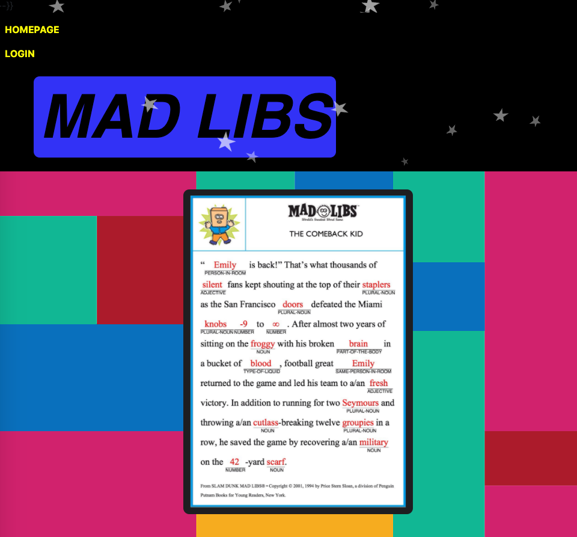
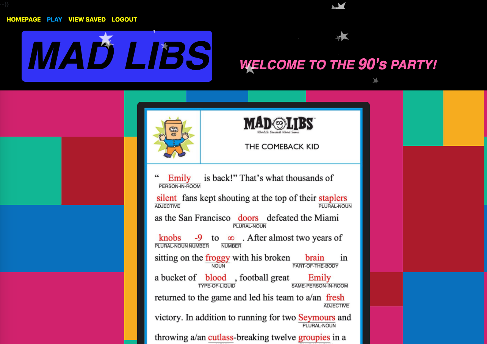
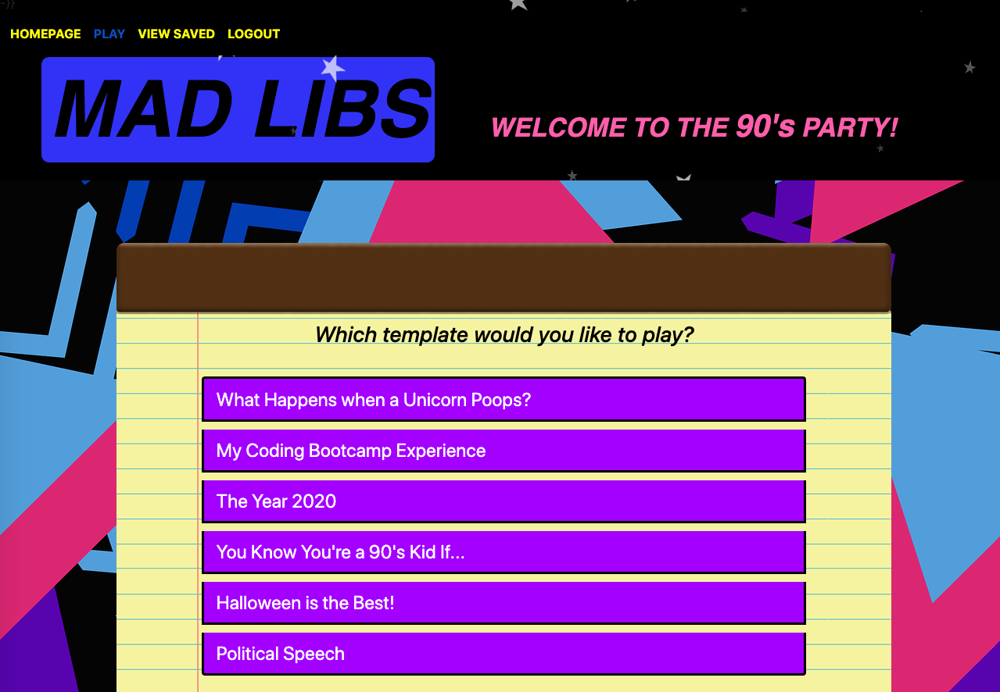
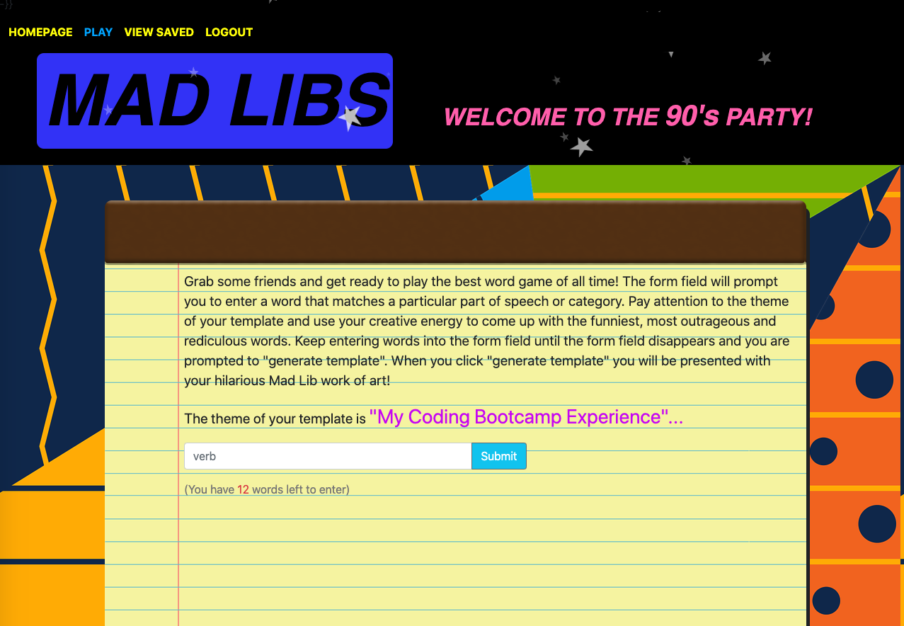

   

# Mad-Libs

## Description   
A Mad Libs word game played online where the user can select from different templates to play. The have the option to save the finished story or play again.

***
### Table of Contents  
1. [Technologies](https://github.com/Kristy-coding/Mad-Libs/tree/feature/randomword#technologies)
2. [User Story](https://github.com/Kristy-coding/Mad-Libs/tree/feature/randomword#user-story)
3. [Screenshot](https://github.com/Kristy-coding/Mad-Libs/tree/feature/randomword#screenshot)
4. [Video Demo Walkthrough](https://github.com/Kristy-coding/Mad-Libs/tree/feature/randomword#video-demo-walkthrough)
5. [License](https://github.com/Kristy-coding/Mad-Libs/tree/feature/randomword#licenses)
6. [Contributors](https://github.com/Kristy-coding/Mad-Libs/tree/feature/randomword#contributors)
7. [Questions](https://github.com/Kristy-coding/Mad-Libs/tree/feature/randomword#questions)  

***
### Technologies   
MySQL   
Node
Sequelize
Express
bcrypt
donenv
clickspark.js
sparkle.js
Handlebars   

***
### User Story   
As a user I want to be able to play Mad Libs words games! When I login then I am presented with additional options on the dashboard and a session is saved. When I click play then I am presented with a menu of Mad Libs templates to choose from. When I click a template option then I am prompted to enter words of a particular part of speech or category. When I  enter all of the words needed to complete the story then I am prompted to “generate template”. When I click “generate template” then I am presented with a completed Mad Libs story that includes the words that I inputted. When I am done reading my completed story, then I have the option to save that story or play again. When I choose to save my story  then I am taken to the “view saved” page. On the “view saved” tab I can view all completed stories that I chose to save (belonging to me as the user), I also have the option to delete saved stories. When I choose to play again, then I am routed back to the menu. When I click the “word bank” tab on the dashboard then I am routed to the “word bank” page. When I click logout, then the session is ended and my dashboard options revert back to “Homepage” and “login”. 

***
### Screenshots  
  

  

  

  

***
### Video Demo Walkthrough
[Video]()

***
### Licenses   
This application is covered under the MIT license

***
### Contributors  
Kristy Zurmuhlen   
Maria Cannon   
Bret Sperry   
Michele Lee Lynch   

***
### Questions  
Github: Kristy-coding   
Email: kristyzurmuhlen@gmail.com   

Github: MCannon33   
Email:   

Github: Bretbret18   
Email:   

Github: MLLynch2K  
Email: michele.lynch8@yahoo.com   
